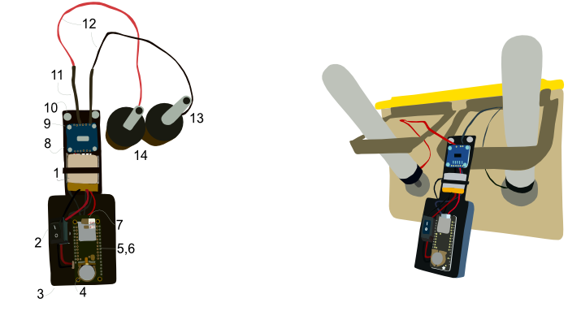

# Spout
This is the general repository where all Spout related information can be found. 

Spout is a device that tracks rodent liquid consumption in a home cage environment. It can be built by any individual with minimnal soldeirng experience and is cost effective. This repository includes the [construction guide](https://github.com/eb-margolis-neuroscience-lab/Spout/tree/main/Spout_Construction_Guide), [arduino code for the device](https://github.com/eb-margolis-neuroscience-lab/Spout/tree/main/arduino%20code), and the [anaylsis software](https://github.com/eb-margolis-neuroscience-lab/Spout/tree/main/SpoutAnalyze) that was created for the device. You can find the publication [here]().

## [Contruction Guide](https://github.com/eb-margolis-neuroscience-lab/Spout/tree/main/Spout_Construction_Guide)

The contruction guide describes how to build the Spout device. It includes links to all the necessary components, 3D print files, wiring diagrams, soldering tutorials, and all details needed for an electrical engineering novice to build this device. Accessibility was an important factor when creating Spout. The device is cost effective and can be built by anyone, regardless of electrical engineering experience. The soldering tutorials linked in the construction guide should an adequate introcution to master the limited soldering needed to build the device. 

  

## [Arduino Code](https://github.com/eb-margolis-neuroscience-lab/Spout/tree/main/arduino%20code)

The arduino code folder includes the real time clock code, which must be flashed onto the device to set the coin battery clock prior to the SpoutCollect code, and the most updated C++ file (SpoutCollect.ino) that tells the device how to collect data. The user must download these files onto their computer, and then starting with pcf8523, the user uploads the two files onto the Spout device that is connected to the computer with a micro USB cable. In the arduino code folder there are links to adruino tutorials to help people that do not have much programming experience. 

## [SpoutAnalyze](https://github.com/eb-margolis-neuroscience-lab/Spout/tree/main/SpoutAnalyze)

SpoutAnalyze is the analysis software that is downloaded onto the users computer in order to analyze the collected csv files into useable data. The user takes the csv files off the microSD card that collects the data directly from the device, and uploads these files into SpoutAnalyze. SpoutAnalyze reads the csv files and produces time-locked consumption graphs, estimated total volume consumed, total bout time,  longest bout, median bout time, and drinking bout length histograms for each spout. It also has the function to summarize groups of data at once under the "analyze group" tab. This folder also includes a video tutorial explaining how to use the program. 
