# Spout construction guide
This guide explains how to assemble the Margolis Lab Spout, a cost effective device that tracks rodent liquid consumption in the animal's home cage for up to two different bottles. The device collects data and the desktop app ['SpoutAnalyze'](https://github.com/eb-margolis-neuroscience-lab/SpoutJS-LIQR) analyzes it and generates visualizations. 
A link to the Spout journal article [will be] found here ()
## Materials 

| | Component | Number | Cost per unit | Total cost | Source|
|-|-----------|--------|---------------|------------|-------|
| 1 | Lithium ion battery (capacity = 500mAh) | 1| $7.95 | $7.95 | [Adafruit Lithium Ion Battery](https://www.adafruit.com/product/1578) |
| 2 | Switch | 1 | $1.72 | $1.72 | [Switch](https://www.digikey.com/en/products/detail/triad-components-group,-inc/RF1-1B-DC-2-B-1/11492841?utm_adgroup=Triad%20Components%20Group%2C%20INC&utm_source=google&utm_medium=cpc&utm_campaign=Shopping_DK%2BSupplier_Tier%201%20-%20Block%201&utm_term=&utm_content=Triad%20Components%20Group%2C%20INC&gclid=EAIaIQobChMI2vfoy7Ca_AIVKQ2tBh3Y_wqhEAQYASABEgJIcvD_BwE) |
| 3 | 3D printed Case | 1 | Cost depends on plastic used |  | [3d Printed case]()
| 4 | Coin Battery | 1 | ~$1 | ~$1 | [Panasonic CR1220 3V coin battery](https://www.panasonic-batteries.com/en/specialty/lithium-coin/coin-lithium-cr1220) |
| 5 | Adafruit Feather Huzzah 32 | 1 | $19.95 | $19.95 | [Adafruit Feather Huzzah32](https://www.adafruit.com/product/3405) |
| 6 | Adafruit Adalogger FeatherWing | 1 | $8.95 | $8.95 | [Adafruit Adalogger Featherwing](https://www.adafruit.com/product/2922) |
| 7 | SanDisk MicroSD card 16GB | 1 | ~$5 | ~$5 | [SanDisk MicroSD 16GB 3-pack](https://www.amazon.com/SanDisk-3-Pack-microSDHC-Memory-3x16GB/dp/B089DPCJS1/ref=asc_df_B089DPCJS1/?tag=hyprod-20&linkCode=df0&hvadid=459728334703&hvpos=&hvnetw=g&hvrand=16697362469703434101&hvpone=&hvptwo=&hvqmt=&hvdev=c&hvdvcmdl=&hvlocint=&hvlocphy=9031942&hvtargid=pla-928853068500&th=1) |
| 8 | Standalone 5 Key Capacitive Touch Sensor | 1 | $7.50 | $7.50 | [Adafruit capacitive touch sensor](https://www.adafruit.com/product/1362) |
| 9 | Small screws and nuts to secure boards | 8 |  |   | [screws]() |
| 10 | Large screws and nuts for case | 2 |   |   | [large screws]() | 
| 11 | Heat shrink |  | $0.01 | $0.01 | [Heat Shrink](https://www.amazon.com/625pcs-Shrink-Tubing-Tubes-Ratio/dp/B07QM8249H?th=1) |
| 12 | Wires | 6 | $0.65/foot| $1.95 | [Stranded electrical wire](https://www.amazon.com/BNTECHGO-Silicone-Flexible-Strands-Stranded/dp/B01MFEV8SG/ref=asc_df_B01MFEV8SG/?tag=&linkCode=df0&hvadid=366016835942&hvpos=&hvnetw=g&hvrand=988944710791549332&hvpone=&hvptwo=&hvqmt=&hvdev=c&hvdvcmdl=&hvlocint=&hvlocphy=9031942&hvtargid=pla-814573630798&ref=&adgrpid=80266838630&th=1) |
| 13 | Metal spout | 2 |   |   | [metal sipper tube](https://www.altdesign.com/products/rodent-ivc/rodent-ivc-accessories/watering-options/water-bottles/water-bottle-sipper-tubes/straight-tube-with-ball-stainless-steel-2-5-sipper-tube/) |
| 14 | Rubber stopper with hole | 2 |   |   | [rubber stopper with hole](https://www.fishersci.com/shop/products/rubber-stopper-size-6-1-hole-5mm-diameter/S24600?gclid=EAIaIQobChMIp9Lax5ma_AIVKx6tBh1Tog7WEAQYASABEgJHyvD_BwE&ef_id=EAIaIQobChMIp9Lax5ma_AIVKx6tBh1Tog7WEAQYASABEgJHyvD_BwE:G:s&ppc_id=PLA_goog_2086145674_92493245187_S24600__411338805568_10284989336328094723&ev_chn=shop&s_kwcid=AL!4428!3!411338805568!!!g!860332652605!S24600) |

## Case 
The 3D print files for the case can be found here: [Spout body](https://github.com/eb-margolis-neuroscience-lab/lick-o-meter-construction-guide/blob/main/Spout%20body%20final.stl) and [Spout hook](https://github.com/eb-margolis-neuroscience-lab/lick-o-meter-construction-guide/blob/main/Spout%20hook.stl)

Use 2 large screws to secure the neck of the case to the hook so that Spout can hang off the homecage. See [Securing the boards to the case](https://github.com/eb-margolis-neuroscience-lab/lick-o-meter-construction-guide#securing-the-boards-to-the-case) for more information. 

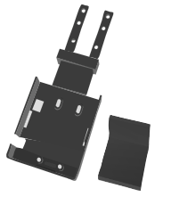

## Wiring the adafruit and adalogger boards 

1. Solder the female headers to the Huzzah32 Board. Soldering tips can be found here: ['How_to_solder'](https://www.youtube.com/watch?v=6rmErwU5E-k) ['Soldering_headers'](https://learn.adafruit.com/how-to-solder-headers/overview?gclid=Cj0KCQjwteOaBhDuARIsADBqRegExwXKagsZyha-ZTaNgmOtfXAZz5pIVzQhtUfN9Gj3rQtBM-4ssycaAh22EALw_wcB) 
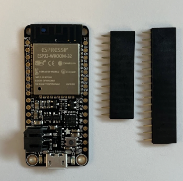
2. Solder the male headers to the adalogger feather board.
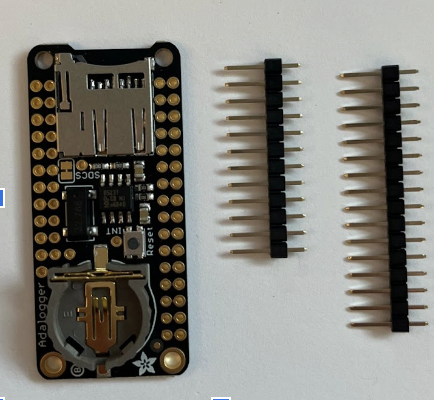

3. Solder four wires to their respective pins on the Adalogger feather board. The wires are soldered to the adalogger board, but the Huzzah32 board has the pin labels. Solder the wires such that wire 1 is attached to the ground pin (**GND**) wire 2 is attached to power pin (**3V**), and the two input signal wires are attached to pins **A0** and **A7**. 

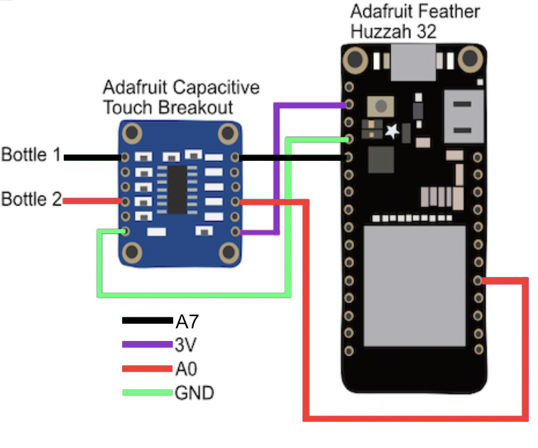

4. Solder the other ends of the four wires to their pins on the **output** side of the Capacitive touch breakout board. **3V** to **VDO**, **GND** to **GND**, **A7** to pin **1**, **A0** to pin **4**. 

### How to modify the wires to fit your metal bottle spouts:
 
 Take two wires and strip 2.5-3 cm of the insulation from one end. Wrap the exposed wire around the base of your metal bottle spout. Solder the wire in a circle that fits snugly around the metal sipper tube. 

 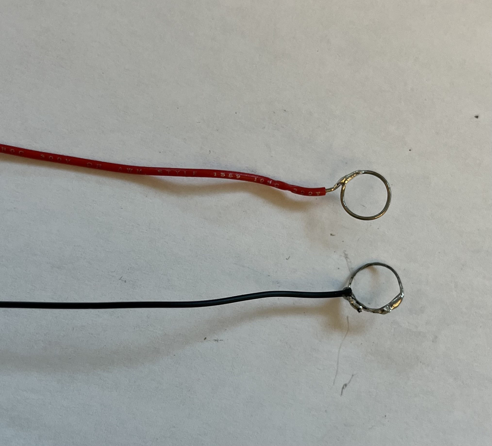 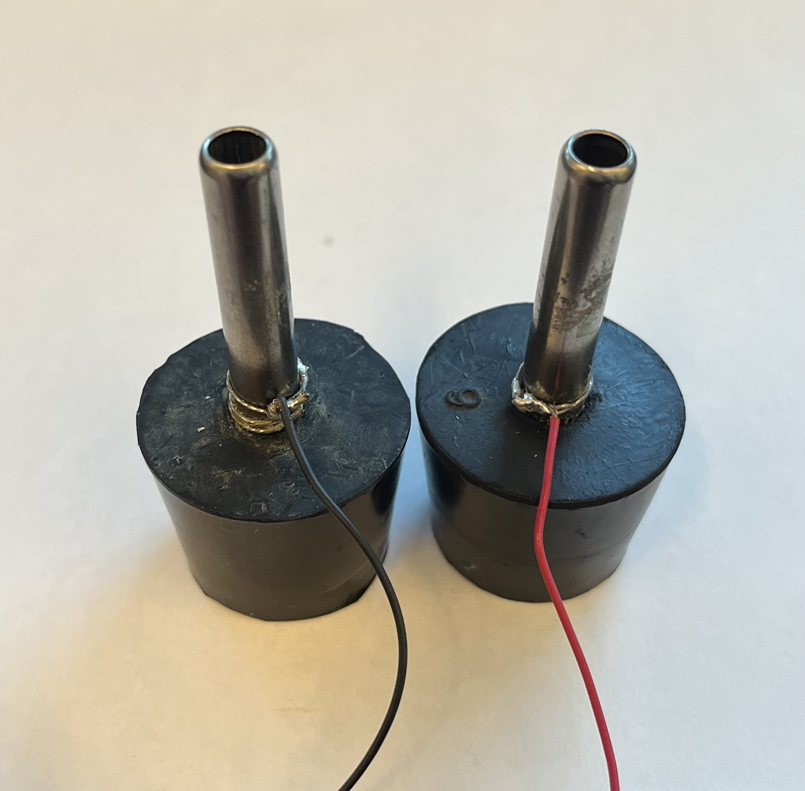

### How to reinforce bottle wire connections
 
 Next these modified wires need to be soldered to the **input** side of the capacitive touch breakout board. This connection undergoes significant and repetitive strain as the bottles are placed and removed. Reinforcement is optional, but we recommend it. You may choose to skip to **step 5**. 
1. Strip about 1.5 cm of coating off the non-modified ends of the bottle wires.

2. Take 2.5 cm long pieces of heat shrink and feed them over each wire.
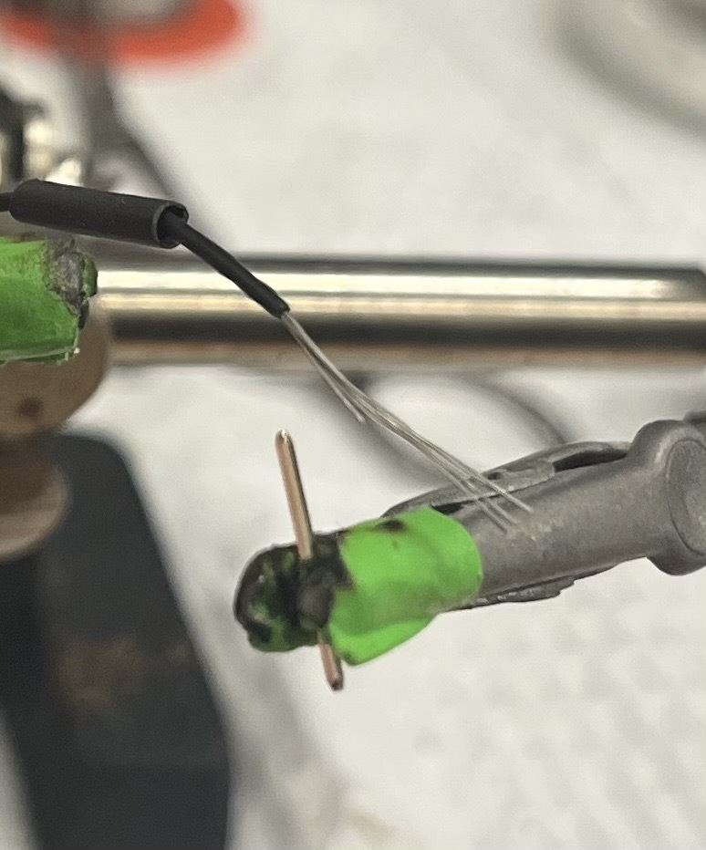

3. Take one single male header pin and solder the long end of the pin to the exposed wire. Repeat on other wire. 
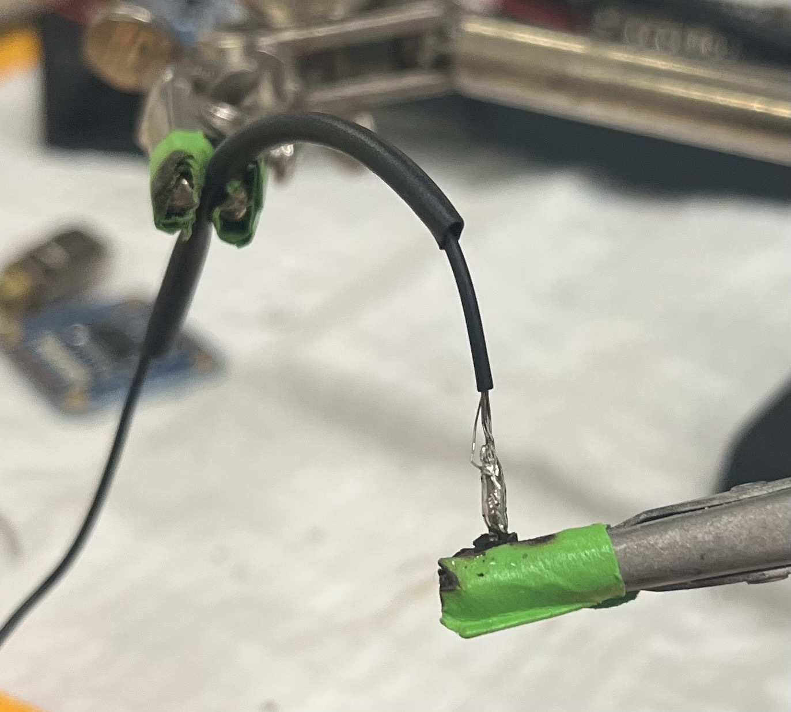

4. Move heat shrink over the soldered connection between the wire and the male header pin. Heat to secure. Reapeat on other wire. 

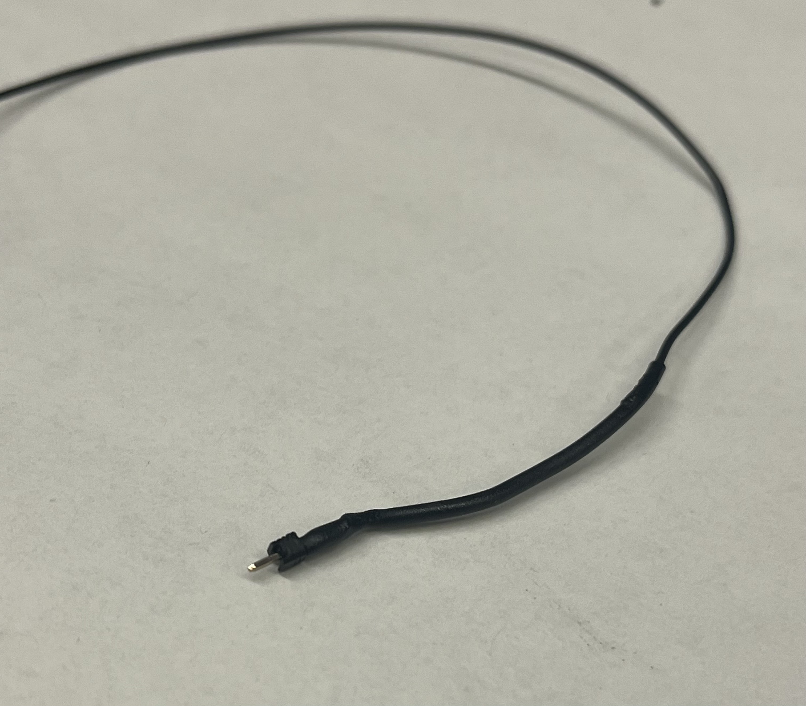

5. Solder the two modified bottle spout wires to pins **1** and **4** on the **input** side of the Adafruit capacitive touch breakout board. If you reinforced the bottle spout wire connection, solder the short ends of the male header pins into pins 1 and 4. 

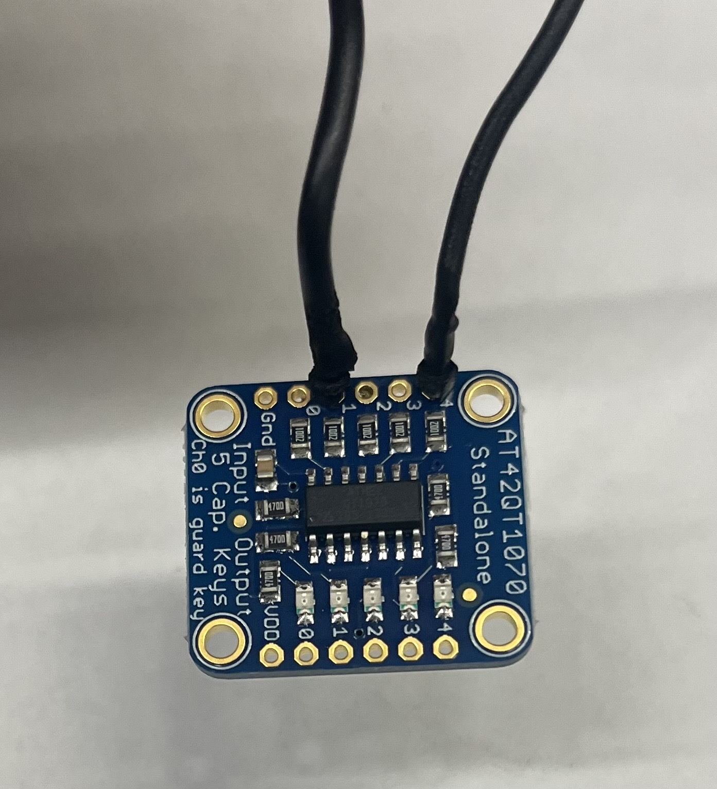

6. Stack the Adalogger board on top of the Huzzah32 board, lining them up by the header pins. 

7. Insert the coin cell battery into the Adalogger feather board. Note: This battery powers the real time clock (RTC), not the device.

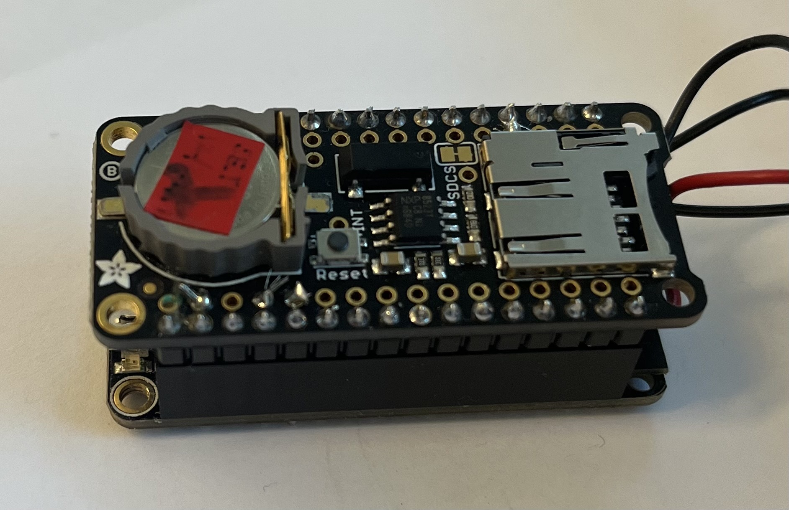

## Securing the boards to the case 

Using screws secure the Huzzah32 and Feather boards to the base of the case and the capacitive sensor board to the neck of the case. 

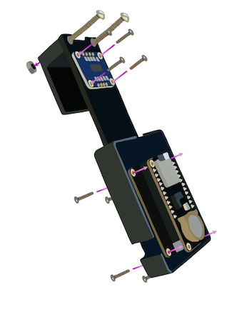

## Adding a switch to the lithium battery 

The SpoutCollect device starts writing data immediately when it is powered on. In order to easily start and stop the device after it is mounted in place on the cage we add a switch to the lithium battery that powers the device. We have found that a 3.7 V 500 mAh Li-ion battery is sufficient to run the device for well over 24 hr. Larger capacity batteries can be used as well, as long as the connector is compatible with the Huzzah32. 

1. Cut the **red wire** of the battery at its halfway point. Strip 1 cm of wire insulation from each of the ends just created.

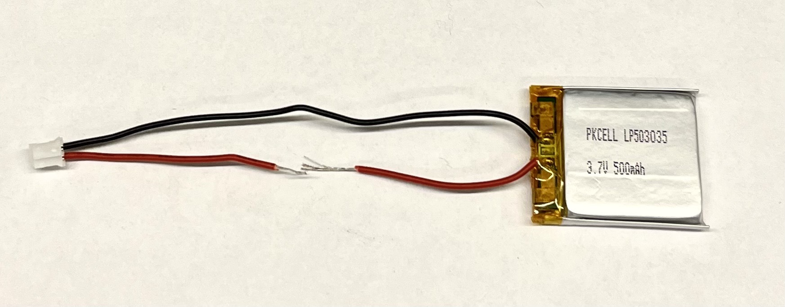

2. Solder these ends to the leads on the switch.

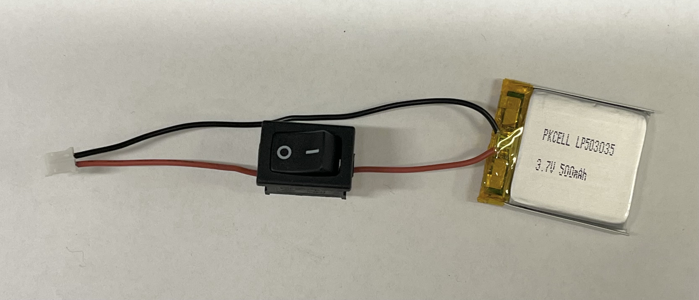

3. The battery slides under the plastic arch on the neck of the case and the legs of the battery fit into the square hole on the body of the case next to the Huzzah32. See graphic below. 

Make sure the switch is in the **ON position** when charging. Charging is acomplished through the micro USB connector.

## Firmware installation  
 1. If you don't already have it, install the [Arduino IDE](https://www.arduino.cc/en/software) which will upload the compiled code to the device. then follow the [instructions](https://learn.adafruit.com/adafruit-esp32-feather-v2/arduino-ide-setup) on the Adafruit website to install the required libraries for the Huzzah32. 
 2. The real time clock (RTC) will hold the date and time so that data can be aligned with time of day. Follow [these instructions](https://learn.adafruit.com/adafruit-pcf8523-real-time-clock/rtc-with-arduino), except the wiring part, to prepare to set the RTC. 
 3. To set the RTC, connect the Spout device to the computer and flash [RTC_PCF8523](https://github.com/eb-margolis-neuroscience-lab/lick-o-meter-construction-guide/blob/main/pcf8523.ino) onto it. The clock will be set based on the time and date on the computer. To check that the clock is set and functioning open the Arduino IDE serial monitor with the device still connected to the computer. 
4. Use the Arduino IDE to flash [SpoutCollect](https://github.com/eb-margolis-neuroscience-lab/lick-o-meter-construction-guide/blob/main/SpoutCollectOct2022.ino) onto the device. 
5. Disconnect the device from the computer and insert a micro SD card. 

## Hanging your device on the homecage 
Here are some images that show how to hang the Spout on two different types of cages: 

  

 

## Your device is ready for use!

To use, hang on home cage and turn battery switch to ON. To transfer collected data to the computer for analysis remove the microSD card and connect it to the computer using a card reader or adapter. 

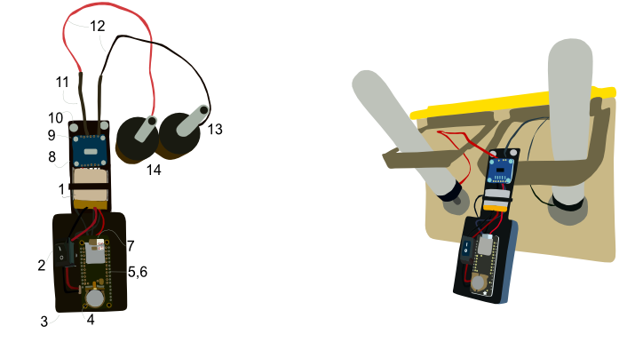

